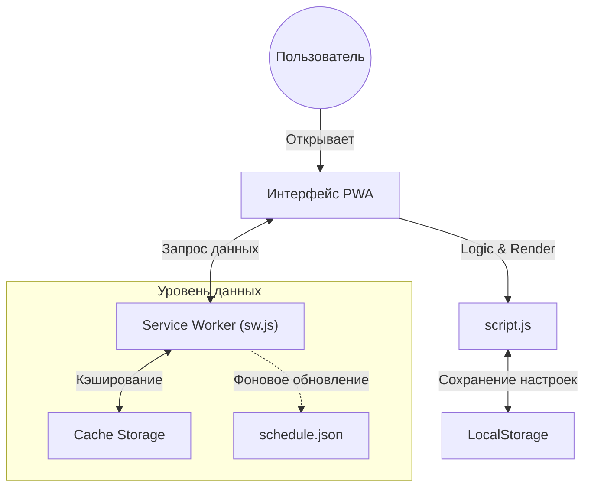

<div align="center">
  

  <p align="center">
    <strong>Адаптивное веб-приложение (PWA) для просмотра расписания с поддержкой Offline-first и темной темы.</strong>
  </p>

  
  
  
  
  
</div>

---

### 🎯 Обзор проекта

**KIT Schedule PWA** — это клиентское Single Page Application (SPA), обеспечивающее мгновенный доступ к расписанию занятий. Приложение разработано с упором на производительность и автономность: благодаря Service Worker оно кэширует ресурсы и данные, позволяя просматривать расписание даже без подключения к интернету.

Система поддерживает поиск, фильтрацию и сохранение избранных групп, преподавателей и аудиторий в локальном хранилище устройства.

---

### 🏗 Архитектура системы

В проекте реализована стратегия **Cache-First** (для статики) и **Stale-While-Revalidate** (для данных), что обеспечивает мгновенную загрузку:



---

### 🔥 Ключевые возможности

* **Three Operation Modes:**
* `GROUPS` — Расписание для студентов (поиск по номеру группы).
* `TEACHERS` — Расписание для преподавателей.
* `ROOMS` — Загруженность аудиторий.


* **Smart Navigation & UI:**
* **Swipe Gestures:** Переключение между днями свайпом влево/вправо.
* **View Modes:** Переключение между "Неделей" (Пн-Сб) и "Датами" (календарный список).
* **Dark Theme:** Глубокая интеграция темной темы (`#09090b`) для экономии заряда OLED-экранов.


* **Offline Capabilities:**
* **Service Worker:** Полное кэширование JS, CSS и ассетов.
* **Installable:** Поддержка установки на домашний экран (Manifest V2).
* **Auto-Update:** Версионирование кэша (`schedule-app-dev-v33`) для обновления без перезагрузки.


* **Data Management:**
* **Favorites:** Списки "Избранного" хранятся локально на устройстве пользователя.
* **Week Parity:** Автоматическое определение четной/нечетной недели.


---

### 🛠 Технический стек

* **Core:** Vanilla JavaScript (ES6+), HTML5
* **Styling:** CSS3 Variables, Flexbox/Grid, Mobile-First
* **PWA:** Service Worker API, Web App Manifest
* **Storage:** LocalStorage API (User prefs), Cache API (Assets)
* **Data Source:** Static JSON

---

### 🚀 Быстрый запуск

#### 1. Структура данных

Для работы приложения необходим файл `schedule.json` в корневой директории со следующей структурой:

```json
{
  "groups": {
    "4434": [
      {
        "dayId": 0,
        "lessons": [
           { 
             "time": "08:00 - 09:30", 
             "subject": "Физика", 
             "type": "ЛЕК", 
             "room": "301", 
             "teacher": "Иванов А.А.", 
             "dates": "все" 
           }
        ]
      }
    ]
  },
  "teachers": {},
  "rooms": {}
}

```

#### 2. Запуск локально

Так как используются Service Workers, приложению требуется контекст безопасности (HTTPS или localhost).

**Вариант А (Python):**

```bash
python3 -m http.server 8080
# Открыть http://localhost:8080

```

**Вариант Б (Node.js):**

```bash
npx http-server .
# Открыть http://localhost:8080

```

#### 3. Использование

1. Откройте приложение в браузере.
2. Нажмите **"+ Добавить"** на главном экране.
3. Введите номер группы (например, `4434`) или фамилию преподавателя.
4. (Опционально) Нажмите "Поделиться" -> "На экран 'Домой'" для установки PWA.

---

<div align="center">
<sub>Built with ❤️ by Alerto</sub>
</div>
